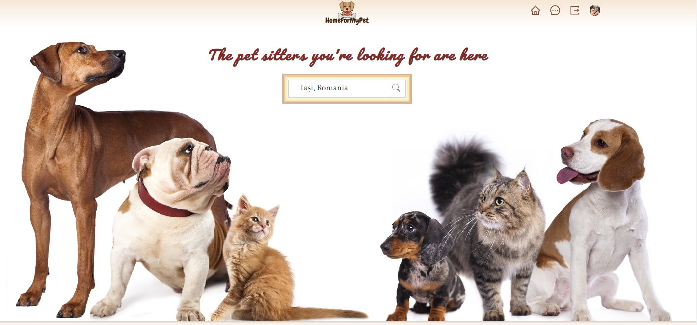

# Home For My Pet
 

## Overview
*Home For My Pet* is a web application specially designed and developed for pet lovers located in Romania. The main role of the app is to help connect pet owners with people who offer their pet boarding and care services. 
The main features of the app include:
- Create an account;
- Register as a Pet Sitter or Pet Owner;
- Access to the Profile page;
- Access to Chat;
- Access to Home page where Pet Sitters can be filtered by location. 

The site was developed using ReactJs and deployed on Firebase. The data was stored using the Firebase Firestore database.
  
The fully deployed project can be accessed at [this link](https://homeformypet-project.web.app). 
The development is in process. 
